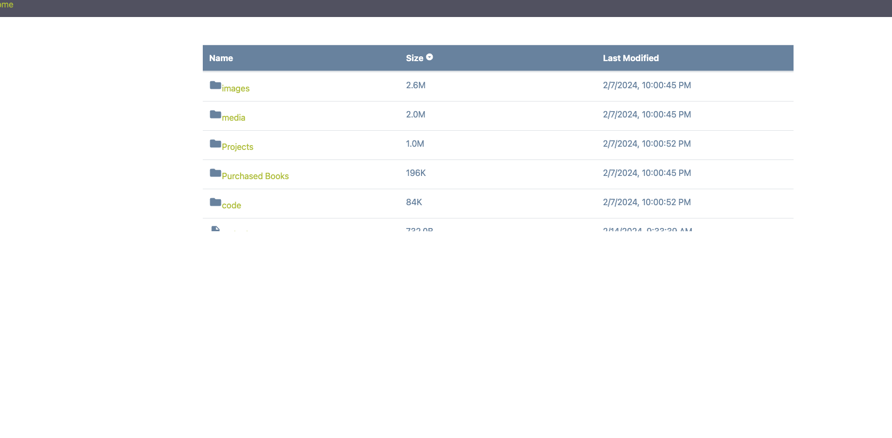

# NodeJS-Online-File-Explorer
NodeJS Online File Explorer Application 

## Description

- This is a file explorer program built entirely with Node JS that allows users to visually see all of the files and folders in their current working directory 
- If a user clicks on a file, the program will display the file contents (including playing audio and videos in the browser)
- this is done efficiently by streaming chunks of data 
- Users can sort files by name, date modified, and size
- the front-end was built using bootstrap and basic HTML


## Table of Contents (Optional)

- [Installation](#installation)
- [Usage](#usage)
- [Credits](#credits)
- [License](#license)

## Installation

```sh
npm install && node index.js
```


## Usage



## Deployed Link
[https://secure-dusk-54693-2257fab8424a.herokuapp.com]

